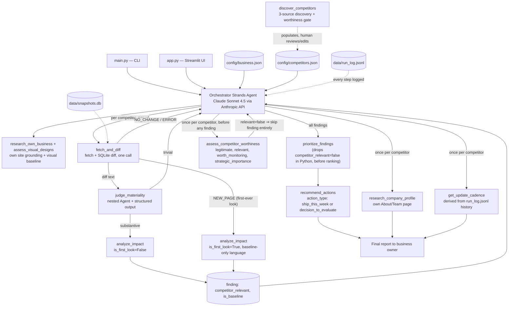

# Architecture

## The core idea: one orchestrator, several nested agents

`src/agent.py` is a single Strands `Agent` given a system prompt and a toolbox. It
decides for itself, turn by turn, which tool to call next based on what the previous
one returned — a genuine agentic loop, not a hardcoded script. Several of its tools —
`judge_materiality`, `analyze_impact`, `prioritize_findings`, `recommend_actions`,
`assess_competitor_worthiness`, `assess_visual_designs`, `research_company_profile` —
are themselves a small nested `Agent` with a focused system prompt and a Pydantic
`structured_output_model`, each independently built and testable. A single run
involves 10-45+ real model calls, not one prompt wrapped in a chat UI.

## Competitor discovery — three sources, one gate

`discover_competitors` (`src/tools/discover_tool.py`) tries three candidate sources in
order, all then verified the same way:

1. **Real "alternatives" page search** — searches `"<business> alternatives"`/
   `"...competitors"`, fetches a real result (often a G2/listicle-style page), and has
   a nested Agent verify the page is genuinely about *this* business before trusting
   anything on it. Company names collide (verified live rejecting a same-named
   customer-support company's page, and a Honda Accord car-comparison article, when
   discovering for businesses named "Accord") - this check is mandatory, not optional.
2. **Category/feature search fallback** — some niches have no G2/listicle presence at
   all (verified live: a digital play-therapy tool had none anywhere online). When #1
   finds nothing, this generates category/feature search phrases instead of searching
   the business's own name, and treats organic search results themselves as candidate
   competitor homepages, verified by a different check: "is this a genuine same-
   category competing product," not "is this about the same business."
3. **Model's own market knowledge**, as a final fallback/supplement, proposing real
   competitor names and likely domains from training data - told never to invent a
   company or guess at a domain it isn't confident about.

Every candidate from any source gets a live fetch to verify the domain actually
resolves (`www.` retry, then a keyless DuckDuckGo search as a last resort for a wrong
guess) before it's trusted, then passes through:

**The worthiness gate** (`assess_competitor_worthiness`, `src/tools/worthiness_tool.py`)
— a nested Agent judging four things: `legitimate` (a real, functioning page, not a
placeholder/parked/dead domain), `relevant` (same *primary function/workflow* as the
business, not shared industry or marketing buzzwords — and if a target region is set,
region-fit is part of relevance, verified against real coverage/pricing/FAQ pages
fetched by the tool itself, never inferred from a word like "nationwide" or a
compliance badge like HIPAA), `worth_monitoring` (should this be checked often for
near-term actionable signals), and `strategic_importance` (how much the owner should
be aware of this player's trajectory at all, independent of monitoring cadence — a
giant platform can be strategically important while being a poor use of weekly
monitoring time). A candidate makes the list if legitimate + relevant, and either
worth_monitoring or strategic_importance is "high".

Because candidate proposals are stochastic, a narrow niche can produce an all-reject
round. Rather than loosen the gate, discovery retries with fresh, non-repeated
candidates for up to 3 rounds - and returns fewer than requested rather than padding
with rejects if it still comes up short. Discovery is human-in-the-loop by design:
results populate the UI table for review/editing, not silent auto-adoption.

## Grounding in the user's own real site, not just their typed description

The orchestrator fetches the business's own site (`research_own_business`) and runs a
visual baseline on it (`assess_visual_designs`) *before* touching any competitor.
Every `analyze_impact`/`recommend_actions` call is given this live excerpt so
judgments are grounded in what the site actually currently says, not just what the
owner typed - and competitor visual critiques are directly comparable against a real
baseline instead of judged in isolation.

## Change vs. baseline — a fabricated-event bug and its structural fix

A real bug shipped and was caught live: a first-ever look at a competitor (no prior
snapshot, `fetch_and_diff` returns `NEW_PAGE`) was written up as an active change
("has pivoted dramatically") when nothing had actually been observed to move. The fix
is structural, not just a politer prompt:

- `analyze_impact` (`src/tools/impact_tool.py`) takes `is_first_look: bool`, which
  switches to an entirely different system prompt banning change-implying language
  ("now", "recently", "pivoted", "has shifted") and mechanically enforces it - the
  output is regex-checked and regenerated once with a corrective instruction if
  violated. The tool's return always includes `is_baseline` matching the input flag
  exactly, so downstream code never has to re-derive or trust the model to remember it.
- Every finding dict carries `is_baseline` through prioritization unchanged; the
  orchestrator picks "Current State" vs. "What Changed" framing per item from this
  flag, and reframes the whole report as "Initial Competitive Positioning" rather than
  "Priority Actions" when every finding this run is baseline.

## A rejected competitor still reaching the final recommendation — and its fix

An even worse bug, caught live: the worthiness gate correctly marked a competitor
`relevant: false`, and the final report *still* recommended restructuring pricing to
counter it - the gate's verdict was reported in a side section instead of actually
filtering the findings pool. The fix has two layers, mirroring the change/baseline fix:

1. **Mechanical filter (the real fix):** `prioritize_findings` requires
   `competitor_relevant: bool` on every finding and drops (fails closed - missing or
   false is dropped, never defaults to included) anything not explicitly marked
   relevant, in plain Python, before the LLM ever sees the list. A sloppy orchestrator
   call cannot leak a rejected competitor through no matter what it asks for.
2. **Reordered orchestration:** the worthiness gate now runs per-competitor *before*
   any materiality/impact work, so an irrelevant competitor never gets a finding built
   for it in the first place.

The same run also revealed a second, related failure: `prioritize_findings` will pad a
weak 3rd slot just to fill a "top 3" quota. The prompt now explicitly allows 0, 1, or 2
items with no apology - padding is treated as a worse failure than a short list.

## Visual scoring needed comparison, not isolation — twice

Scoring each competitor's screenshot in its own isolated call regressed to a template:
unrelated sites all scored ~7/9 with an identical "feels corporate and cold, no
testimonials" critique. Fix: `assess_visual_designs` (`src/tools/visual_tool.py`)
sends every site's screenshot (the business's own plus every competitor) to ONE nested
Agent call, required to produce a strict rank order and reference at least one other
site by name in every justification. This regressed on a *later* run (three of four
sites tied at an identical score) because the prompt still had an escape hatch
("unless genuinely indistinguishable"). Fix: the escape hatch is gone, and a
mechanical check (`_find_duplicates`) detects any duplicate rank or duplicate score
pair after the call and forces one retry - on the same images, with the specific
duplicates named - rather than trusting the instruction alone.

## The reversibility filter — pricing changes are not a one-week task

Across multiple test businesses, `recommend_actions` kept proposing a pricing/
packaging/positioning change framed as a one-week ship task ("launch a freemium tier
this week," "publish $19/mo pricing this week") - the highest-blast-radius, hardest-
to-reverse category of advice a small business can receive. `Recommendation`
(`src/schemas.py`) now has a required `action_type: "ship_this_week" |
"decision_to_evaluate"` field: anything touching pricing/packaging/positioning must be
`decision_to_evaluate` (framed as a decision with evidence to gather first, never a
task to ship), regardless of how minor it sounds; only genuinely reversible actions
(content, messaging, ads) can be `ship_this_week`.

## Why fetch and diff are one tool call

`fetch_and_diff` fetches the page *and* diffs it against SQLite inside a single tool,
rather than exposing fetch and diff as two calls the orchestrator wires together
itself. If the model had to pass the full fetched page text back out as a tool-call
argument, that argument generation counts against the model's own output-token budget
- with several competitor pages in one turn this reliably blew through `max_tokens`
and crashed the run. Keeping the large text on the Python side and only passing
`competitor_id`/`url` through the model avoids that entirely. `fetch_page` still
exists standalone and is unit-tested; it's just not the tool the orchestrator calls
directly.

## Two more scraping-accuracy fixes

- **Marketing claims laundered into fact:** a business's own self-reported number
  (a revenue-lift or savings claim) was being restated as an established fact to
  justify a recommendation. `impact_tool.py`, `recommend_tool.py`, and
  `prioritize_tool.py` all now instruct: attribute a self-reported number ("they
  claim X"), never state it as fact, never use one as the sole justification for an
  action.
- **JS count-up animations scraped as literal zeros:** plain `requests`+BeautifulSoup
  never runs the script that animates "1,500,000+ Parcels" to its real value, so the
  pre-animation "0+" was available to be cited as a real zero. `fetch_tool.py` now
  flags any `0+` pattern as `[STAT UNAVAILABLE - likely an unrendered JS counter]`
  rather than passing it through silently.

## Frontend

`app.py` is a Streamlit UI over the exact same backend validated on the CLI - it edits
`config/business.json`/`config/competitors.json` (the same files `src/main.py`
reads), calls `run_pipeline()` from `src/agent.py` unchanged, then reads the new lines
appended to `data/run_log.jsonl` during that run to render the step-by-step trace. No
agent logic lives in the UI layer.

## Reasoning trace

Every tool call logs a one-line human-readable entry to stdout and a full JSON record
to `data/run_log.jsonl` via `src/trace.py`, so the demo can show *why* each step
happened (which competitor, what was found, why it was ranked where it was, why that
specific tool was recommended) rather than just the final answer.

## No AWS Bedrock / no billed AWS service

The model provider is Anthropic's API directly (`strands.models.anthropic.AnthropicModel`),
authenticated with `ANTHROPIC_API_KEY`. Nothing in this project touches AWS.
